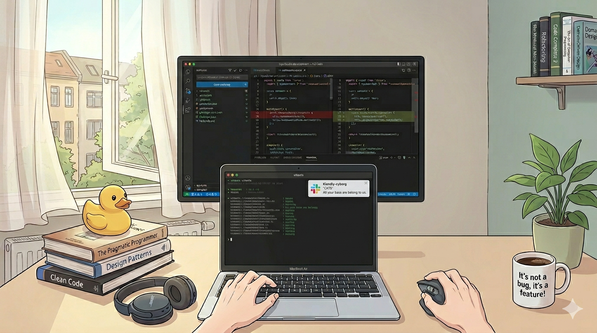

<picture>
  <source media="(prefers-color-scheme: dark)" srcset="https://camo.githubusercontent.com/4d8d5afc54f85dfc3589186ed43df17f57ad3b87165c30c0c538b85d380d650c/68747470733a2f2f726561646d652d747970696e672d7376672e6865726f6b756170702e636f6d3f666f6e743d4a6574427261696e732b4d6f6e6f2670617573653d3130303026636f6c6f723d4646464646462677696474683d343335266c696e65733d48692b74686572652b2546302539462539312538423b57656c636f6d652b746f2b6d792b4769746875622b70726f66696c652b706167652e3b49276d2b44617669642b536965676572732b616b612e2b6a696d6d796f7270686575732e3b536f6674776172652b69732b6d792b70617373696f6e2b2532362b70726f66657373696f6e2e3b4c657427732b6275696c642b736f6d657468696e672b746f67657468657221">
  <source media="(prefers-color-scheme: light)" srcset="https://camo.githubusercontent.com/5c2625791b2c2664315015f1c224ed44cfdc80c27ee2ab8d9ebfc0e51afec25e/68747470733a2f2f726561646d652d747970696e672d7376672e6865726f6b756170702e636f6d3f666f6e743d4a6574427261696e732b4d6f6e6f2670617573653d3130303026636f6c6f723d3030303030302677696474683d343335266c696e65733d48692b74686572652b2546302539462539312538423b57656c636f6d652b746f2b6d792b4769746875622b70726f66696c652b706167652e3b49276d2b44617669642b536965676572732b616b612e2b6a696d6d796f7270686575732e3b536f6674776172652b69732b6d792b70617373696f6e2b2532362b70726f66657373696f6e2e3b4c657427732b6275696c642b736f6d657468696e672b746f67657468657221">
  
</picture>

<!--
**jimmyorpheus/jimmyorpheus** is a ✨ _special_ ✨ repository because its `README.md` (this file) appears on your GitHub profile.

Here are some ideas to get you started:

- 🔭 I’m currently working on ...
- 🌱 I’m currently learning ...
- 👯 I’m looking to collaborate on ...
- 🤔 I’m looking for help with ...
- 💬 Ask me about ...
- 📫 How to reach me: ...
- 😄 Pronouns: ...
- ⚡ Fun fact: ...
-->
