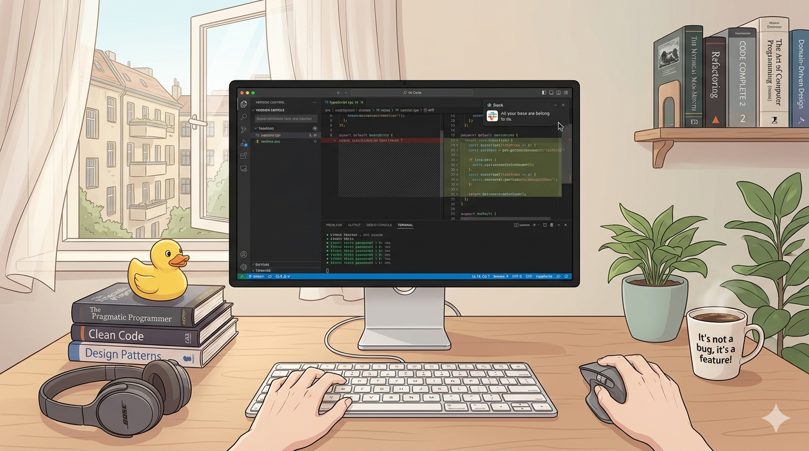

<picture>
  <source media="(prefers-color-scheme: dark)" srcset="./assets/jimmy_orpheus_github_profile_hero_dark_mode.png">
  <source media="(prefers-color-scheme: light)" srcset="./assets/jimmy_orpheus_github_profile_hero_light_mode.png">
  
</picture>

<picture>
  <source media="(prefers-color-scheme: dark)" srcset="./assets/jimmy_orpheus_hi_there_dark_mode.svg">
  <source media="(prefers-color-scheme: light)" srcset="./assets/jimmy_orpheus_hi_there_light_mode.svg">
  
</picture>

## 👨‍💻 Technology Stack

<!-- https://github.com/tandpfun/skill-icons -->

  <picture>
    <source media="(prefers-color-scheme: dark)" srcset="https://skillicons.dev/icons?i=ts,nodejs,react,vue,jest,tailwind,php,symfony,laravel,graphql,gitlab,docker,ansible,jenkins,redis,mysql,postgres,elasticsearch,vscode,phpstorm&theme=dark&perline=10">
    <source media="(prefers-color-scheme: light)" srcset="https://skillicons.dev/icons?i=ts,nodejs,react,vue,jest,tailwind,php,symfony,laravel,graphql,gitlab,docker,ansible,jenkins,redis,mysql,postgres,elasticsearch,vscode,phpstorm&theme=light&perline=10">
    
  </picture>

<!--
**jimmyorpheus/jimmyorpheus** is a ✨ _special_ ✨ repository because its `README.md` (this file) appears on your GitHub profile.

Here are some ideas to get you started:

- 🔭 I’m currently working on ...
- 🌱 I’m currently learning ...
- 👯 I’m looking to collaborate on ...
- 🤔 I’m looking for help with ...
- 💬 Ask me about ...
- 📫 How to reach me: ...
- 😄 Pronouns: ...
- ⚡ Fun fact: ...
-->
